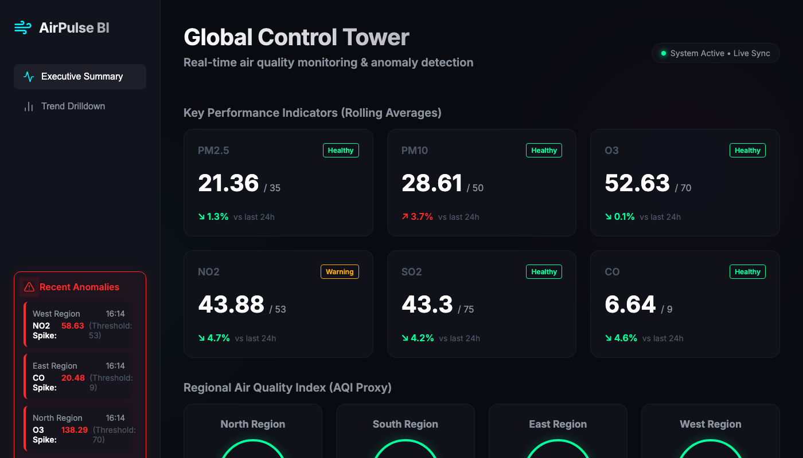
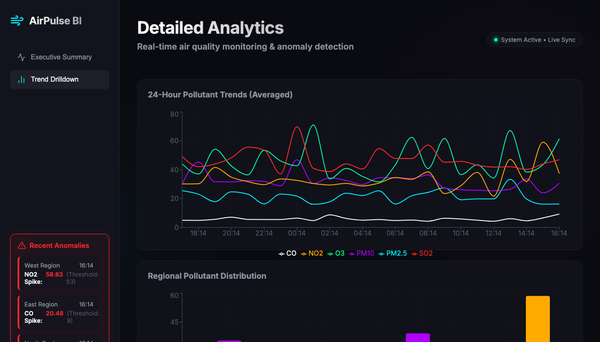

<div align="center">
  
  <br/>
  <h1>💨 AirPulse BI</h1>
  <p><strong>Premium AI-Powered Air Quality Control Tower</strong></p>
  <p><i>A top 1% web-based data intelligence platform for real-time environmental monitoring.</i></p>
  
  <p>
    <a href="#-overview">Overview</a> •
    <a href="#-dashboard-features">Features</a> •
    <a href="#-technology-stack">Tech Stack</a> •
    <a href="#%EF%B8%8F-quick-start">Quick Start</a>
  </p>
</div>

---

## 🚀 Overview

AirPulse BI is an end-to-end data intelligence platform engineered to ingest, process, and visualize real-time air quality metrics. It seamlessly connects a highly optimized **Python/FastAPI** extraction layer with a state-of-the-art **React/Vite** frontend dashboard featuring a striking **"Cyber-Obsidian"** design aesthetic.

Designed to mirror a professional control-tower reporting workflow, this application translates complex environmental data into actionable insights for non-technical stakeholders through real-time anomaly detection and intuitive visual drilldowns.

---

## 📊 Dashboard Features

### 1. Global Control Tower (Executive Summary)
<div align="center">
  
</div>
<br/>

The **Executive Summary** page acts as the primary command center, providing an instant macro-view of the environmental state:
- **Real-Time KPIs**: Monitors 6 primary pollutants (PM2.5, PM10, O3, NO2, SO2, CO) using dynamic rolling averages. Each KPI card features a color-coded health status (`Healthy`, `Warning`, `Critical`) and percentage trend comparisons against the last 24 hours.
- **Regional AQI Gauges**: Displays aggregated Air Quality Index proxies for four distinct geographic zones (North, South, East, West) using glowing, state-reactive radial indicators.
- **Persistent Anomaly Tracker**: The left-hand sidebar actively listens for data spikes. When a pollutant crosses its designated safety threshold, an alert is instantly generated detailing the time, region, and severity of the breach.

### 2. Detailed Analytics (Trend Drilldown)
<div align="center">
  
</div>
<br/>

The **Trend Drilldown** view empowers users to perform deep-dive investigations into historical and comparative data:
- **24-Hour Pollutant Trends**: A responsive, multi-line chart that maps the intricate temporal fluctuations of all six pollutants over the past day, allowing analysts to identify cyclical patterns or prolonged exposure risks.
- **Regional Distribution**: A comparative bar chart that isolates critical pollutants (e.g., PM2.5, PM10, NO2) and breaks them down by region, highlighting geographic disparities in air quality at a glance.
- **Interactive Tooltips**: Built with `Recharts`, hovering over any data point reveals a glassmorphic tooltip with precise measurement values.

---

## 🛠️ Technology Stack

| Layer | Technologies Used | Purpose |
|-------|-------------------|---------|
| **Frontend** | React, Vite, TypeScript | Lightning-fast UI rendering and component architecture |
| **Styling** | Vanilla CSS | Custom "Cyber-Obsidian" aesthetic with glassmorphism |
| **Visualization**| Recharts | High-performance, declarative data charting |
| **Backend** | Python, FastAPI, Uvicorn | High-speed REST APIs and concurrent request handling |
| **Data Engine**| Pandas, Numpy | Data extraction, cleansing, and anomaly simulation |

---

## ⚙️ Quick Start

To run this project locally, you will need to start both the Python data engine and the React frontend concurrently.

### 1. Start the Data Engine (Backend)

Open a terminal and navigate to the `backend` folder:
```bash
cd backend
python3 -m venv venv
source venv/bin/activate
pip install -r requirements.txt

# Run the FastAPI server
uvicorn main:app --reload
```
*Server runs on `http://localhost:8000`*

### 2. Start the Control Tower (Frontend)

Open a **second** terminal and navigate to the `frontend` folder:
```bash
cd frontend
npm install

# Start the Vite development server
npm run dev
```
*Application runs on `http://localhost:5173`*

---
<div align="center">
  <i>Engineered for the Top 1% of Data Intelligence Standards</i>
</div>
